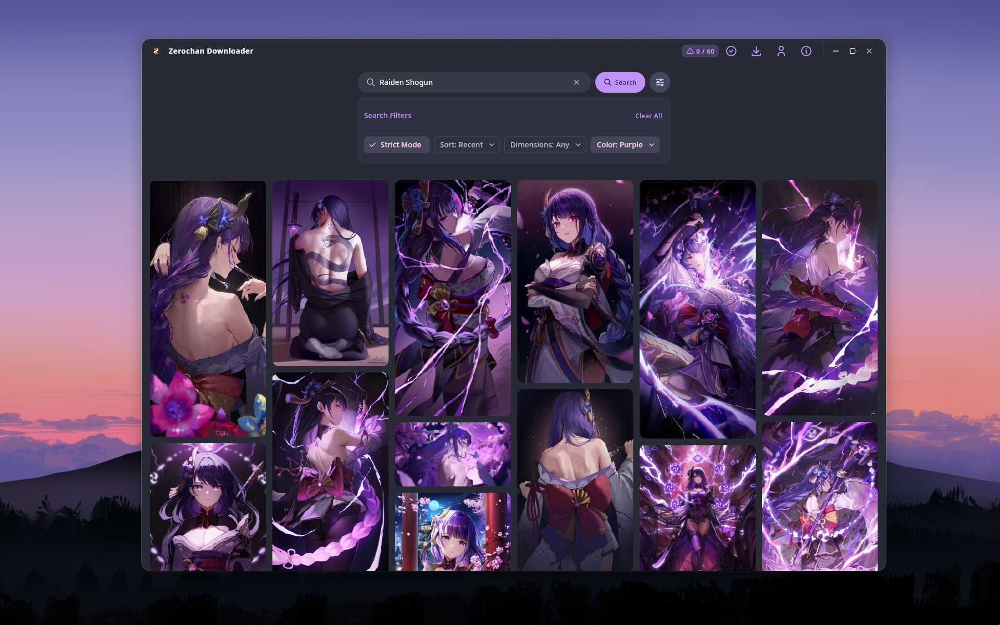

<div align="center">


# Zerochan Downloader

**A clean, native desktop client for browsing and downloading from [Zerochan](https://www.zerochan.net/).**

Built with Kotlin & Compose Multiplatform — runs natively on Windows, Linux, and macOS.

[](https://github.com/jp319/ZerochanDownloader/releases)
[](LICENSE)
[](#installation)
[](https://kotlinlang.org/)

Leave a star if you find this useful! ⭐



</div>

---

## Features

- **Infinite Gallery Browsing** — Staggered grid with smooth infinite scroll
- **Smart Tag Search** — Auto-complete suggestions, recent search history, and advanced filters (dimensions, color, upload time, strict mode)
- **Full-Resolution Downloads** — Deep retry logic to fetch the true original image, bypassing generic CDN 403s
- **Bulk Multi-Select** — Long-press any image to enter Selection Mode. Click or drag your mouse across multiple images to select them all at once
- **Built-in Library** — View, manage, and open downloaded images and their folder directly from within the app
- **Animated GIF Support** — Previews animated images with local caching to avoid redundant downloads
- **Theming** — Multiple accent color themes (Orange, Purple, Pink, Green, Red, Yellow, Cyan)
- **No Login Required** — Uses your Zerochan username for API authentication only. No password ever needed
- **Rate Limiting** — Automatic per-minute request tracking to respect Zerochan's API limits

---

## Powered by the Zerochan API

This application is built entirely on top of the [Zerochan public API](https://www.zerochan.net/api), which is remarkably fast, well-structured, and reliable for a community-run image board. The API provides rich metadata per image including tags, dimensions, file size, and source, all with consistent response times. If you are a developer interested in building on top of Zerochan, their API documentation is well worth reading.

---

## Installation

Download the latest installer for your platform from the [**Releases page**](https://github.com/jp319/ZerochanDownloader/releases).

| Platform                   | Installer                                 |
|----------------------------|-------------------------------------------|
| Windows                    | `.exe` (standalone) or `.msi` (installer) |
| Linux (Debian/Ubuntu/Mint) | `.deb`                                    |
| Linux (Fedora/Arch)        | `.rpm`                                    |
| macOS                      | `.dmg`                                    |

> **Note:** No Java installation is required. All installers bundle their own JVM runtime.

---

## Getting Started

1. Install the application using the installer for your platform.
2. On first launch, the **Welcome Guide** will open automatically. Give it a quick read to get oriented.
3. Open **Settings** (top-right profile icon), and enter your **Zerochan username**.  
   _No password is needed. Your username is only used to identify your session with the Zerochan API._
4. Use the **search bar** to find tags (e.g. `Frieren`, `One Piece`), apply filters, and start browsing!

For full API details, see the [Zerochan API Documentation](https://www.zerochan.net/api).

---

## Building from Source

Requires **JDK 17+** (tested on OpenJDK 24).

```bash
# Clone the repository
git clone https://github.com/jp319/ZerochanDownloader.git
cd ZerochanDownloader

# Run the development build
./gradlew :composeApp:run              # macOS / Linux
.\gradlew.bat :composeApp:run          # Windows
```

### Building a release distributable

```bash
./gradlew :composeApp:createReleaseDistributable
# Output: composeApp/build/compose/binaries/main-release/app/
```

### Building platform installers

```bash
./gradlew :composeApp:packageReleaseDeb   # Debian/Ubuntu .deb
./gradlew :composeApp:packageReleaseRpm   # Fedora/Arch .rpm
./gradlew :composeApp:packageReleaseMsi   # Windows .msi
./gradlew :composeApp:packageReleaseExe   # Windows standalone .exe
./gradlew :composeApp:packageReleaseDmg   # macOS .dmg
```

---

## Architecture

This project follows the **MVVM** architectural pattern.

```
composeApp/src/jvmMain/kotlin/com/jp319/zerochan/
├── data/
│   ├── model/          # Domain data classes (ZerochanItem, ZerochanApiParams)
│   ├── network/        # Ktor HTTP client, request interceptors, rate limiter
│   ├── profile/        # ProfileManager — persistent settings via Java Preferences
│   └── repository/     # ZerochanRepository — API calls & full-res image resolution
├── ui/
│   ├── components/     # Reusable Composables (TopBar, SearchBar, ImageModal, etc.)
│   ├── screens/        # GalleryScreen + GalleryViewModel
│   └── theme/          # AppTheme, color palettes
├── utils/              # Logger, FileUtil (cross-platform URL/folder opening)
├── App.kt              # Root composable, splash screen, profile dialog
└── main.kt             # Entry point, Compose Window setup
```

---

## Contributing

Contributions, issues, and feature requests are welcome!

Before submitting a PR, please keep the following in mind:

- **Logging**: Use `Logger.info(...)`, `Logger.debug(...)`, or `Logger.error(...)`. Avoid raw `println()` calls.
- **KDoc**: Add KDoc comments above core interfaces, models, and public repository methods.
- **Rate Limiting**: Do not disable the built-in 1-second request delay or User-Agent enforcement — removing these risks getting the user's IP banned from Zerochan.
- **Code Style**: Run `./gradlew ktlintFormat` before submitting to ensure consistent formatting.

---

## License

This project is licensed under the **MIT License** — see the [LICENSE](LICENSE) file for details.

---

<div align="center">
Made with care by <a href="https://github.com/jp319">John Fritz P. Antipuesto</a>
</div>